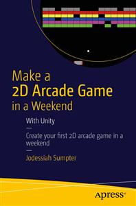

#Apress Source Code

This repository accompanies [*Make a 2D Arcade Game in a Weekend*](http://www.apress.com/9781484214954) by Jodessiah Sumpter (Apress, 2015).

Download the files as a zip using the green button, or clone the repository to your machine using Git.

##Releases

Release v1.0 corresponds to the code in the published book, without corrections or updates.

##Contributions

See the file Contributing.md for more information on how you can contribute to this repository.

##Errata

Page 16 - Figure 3-10 shows the Paddle Game Object assigned to the Ball Script correctly. However I do not mention that the user must drag and drop the paddle_03 Game Object from the Hierachy View to the Paddle variable of the Ball Script in the Inspector View of the Ball Game Object. "

Page 30 (correction) - Figure 2-9 needs to be modified to show the background with a pixels per unit of 50

Page 32 (missing sentence) "In Figure 2-3 under the Camera Inspector is where the new size can be set." to "In Figure 2-3 under the Camera Inspector is where the new size can be set. We will also need to modify the Tranform for Camera to X=8, Y=6.1, Z=-10"

Page 35 (correction) - Readers should create the Brick empty object first and then drag and drop greenbricks (Prefabs) into it. This will allow the coordinates to be relative to the brick object instead of the screen.
